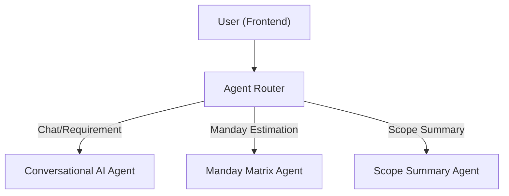

# ADR-01: Agent Routing

## Status
Accepted

## Context
The iRead Customer AI Chat Platform is designed with multiple "Agents" (such as Conversational AI, Manday Matrix, Scope Summary Agent, etc.) to support various features like requirement gathering, manday estimation, and scope summary generation. **Agent Routing** is the mechanism that determines which Agent should process each type of user request or message.

## Decision
- The system will have an **Agent Router** as an intermediary to receive requests/messages from the frontend.
- The Agent Router will analyze the intent or endpoint of each request.
- It will then route the request to the appropriate Agent, for example:
    - If the message is a general chat or requirement, it is routed to the Conversational AI Agent.
    - If the request is for manday estimation, it is routed to the Manday Matrix Agent.
    - If the request is to generate a scope summary, it is routed to the Scope Summary Agent.
- Routing can be rule-based (e.g., by path or keyword) or AI-based (intent classification).

## Consequences
- Increases flexibility for system expansion (new Agents can be added easily).
- Clear separation of responsibilities for each Agent.
- Routing logic can be improved without affecting other Agents.
- May require state or session management between Agents.

## Example
Suppose a user sends a message via the chat interface:
- If the message is a general requirement, the Agent Router forwards it to the Conversational AI Agent.
- If the user requests a manday estimation, the Agent Router forwards the request to the Manday Matrix Agent.
- If the user wants to export a scope summary, the Agent Router forwards the request to the Scope Summary Agent.

## Diagram

## Alternatives Considered
- Let the frontend call each Agent directly (but this increases coupling and makes expansion harder).
- Use microservices for each Agent (may be too complex for the initial phase).

## References
- [ADR Template](https://adr.github.io/)

